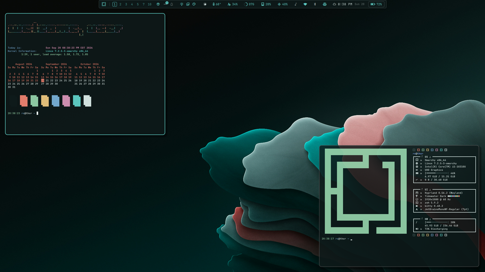

<pre style="line-height: 1.0; font-family: monospace; letter-spacing: 0px;">
     s       .       ..                                                      s                                  ..                                      ..
    :8      @88>   dF                      x=~                              :8                                dF                                  < .z@8"`
   .88       8P   '88bu.                  88x.   .e.   .e.                 .88                  .u    .      '88bu.                     .u    .    !@88E
  :888ooo    .    '*88888bu        .u    '8888X.x888:.x888        u       :888ooo      .u     .d88B :@8c     '*88888bu         u      .d88B :@8c   '888E   u
-*8888888  .@88u    ^"*8888N    ud8888.   `8888  888X '888k    us888u.  -*8888888   ud8888.  ="8888f8888r      ^"*8888N     us888u.  ="8888f8888r   888E u@8NL
  8888    ''888E`  beWE "888L :888'8888.   X888  888X  888X .@88 "8888"   8888    :888'8888.   4888>'88"      beWE "888L .@88 "8888"   4888>'88"    888E`"88*"
  8888      888E   888E  888E d888 '88 "   X888  888X  888X 9888  9888    8888    d888 '88 "   4888> '        888E  888E 9888  9888    4888> '      888E .dN.
  8888      888E   888E  888E 8888.+"      X888  888X  888X 9888  9888    8888    8888.+"      4888>          888E  888E 9888  9888    4888>        888E~8888
 .8888Lu=   888E   888E  888F 8888L       .X888  888X. 888~ 9888  9888   .8888Lu= 8888L       .d888L .+       888E  888F 9888  9888   .d888L .+     888E '888&
 ^ 888*     888&  .888N..888  '8888c. .+  ` 88 ``"*888Y"    9888  9888   ^ 888*   '8888c. .+  ^"8888*"       .888N..888  9888  9888   ^"8888*"      888E  9888.
   'Y"      R888"  `"888*""    "88888       `~     `"       "888*""888"    'Y"     "88888        "Y"          `"888*""   "888*""888"     "Y"      '"888*" 4888"
             ""       ""         "YP'                        ^Y"   ^Y'               "YP'                        ""       ^Y"   ^Y'                  ""    ""

</pre>

---

An Omarchy theme for your Arch Linux / Hyprland setup. Deep teal night water, coral light, and warm sand — the dark half of the Tidewater pair, tuned for a readable terminal and a full palette of terminal colours for TUIs.

## Installation

To install this theme, simply use the `omarchy theme install` command: `omarchy theme install https://github.com/signaldirective/tidewater-dark`

**Theme by [Signal Directive](https://ko-fi.com/signaldirective)**
