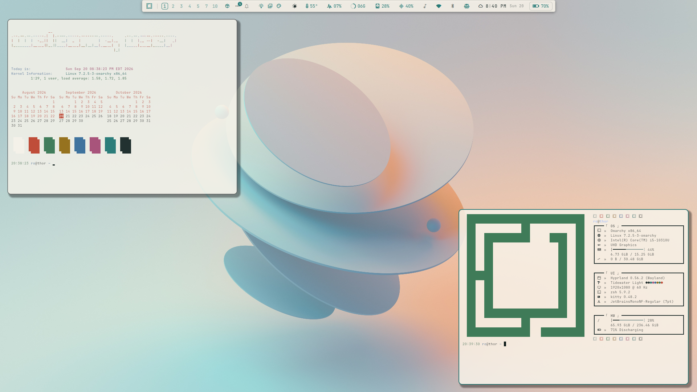

<pre style="line-height: 1.0; font-family: monospace; letter-spacing: 0px;">
     s       .       ..                                                      s                                     ..    .                                 s
    :8      @88>   dF                      x=~                              :8                               x .d88"    @88>                .uef^"        :8
   .88       8P   '88bu.                  88x.   .e.   .e.                 .88                  .u    .       5888R      8P               :d88E          .88
  :888ooo    .    '*88888bu        .u    '8888X.x888:.x888        u       :888ooo      .u     .d88B :@8c      '888R      .         uL     `888E         :888ooo
-*8888888  .@88u    ^"*8888N    ud8888.   `8888  888X '888k    us888u.  -*8888888   ud8888.  ="8888f8888r      888R    .@88u   .ue888Nc..  888E .z8k  -*8888888
  8888    ''888E`  beWE "888L :888'8888.   X888  888X  888X .@88 "8888"   8888    :888'8888.   4888>'88"       888R   ''888E` d88E`"888E`  888E~?888L   8888
  8888      888E   888E  888E d888 '88 "   X888  888X  888X 9888  9888    8888    d888 '88 "   4888> '         888R     888E  888E  888E   888E  888E   8888
  8888      888E   888E  888E 8888.+"      X888  888X  888X 9888  9888    8888    8888.+"      4888>           888R     888E  888E  888E   888E  888E   8888
 .8888Lu=   888E   888E  888F 8888L       .X888  888X. 888~ 9888  9888   .8888Lu= 8888L       .d888L .+        888R     888E  888E  888E   888E  888E  .8888Lu=
 ^ 888*     888&  .888N..888  '8888c. .+  ` 88 ``"*888Y"    9888  9888   ^ 888*   '8888c. .+  ^"8888*"        .888B .   888&  888& .888E   888E  888E  ^ 888*
   'Y"      R888"  `"888*""    "88888       `~     `"       "888*""888"    'Y"     "88888        "Y"          ^*888     R888" *888" 888&  m888N= 888>    'Y"
             ""       ""         "YP'                        ^Y"   ^Y'               "YP'                       "        ""    `"   "888E  `Y"   888
                                                                                                                              .dWi   `88E       J88"
                                                                                                                              4888~  J8         @
                                                                                                                               ^"===*"`       :"
</pre>

---

An Omarchy theme for your Arch Linux / Hyprland setup. Warm paper, teal water, and terracotta — the light half of the Tidewater pair, tuned for a readable terminal and a full palette of terminal colours for TUIs.

## Installation

To install this theme, simply use the `omarchy theme install` command: `omarchy theme install https://github.com/signaldirective/tidewater-light`

**Theme by [Signal Directive](https://ko-fi.com/signaldirective)**
